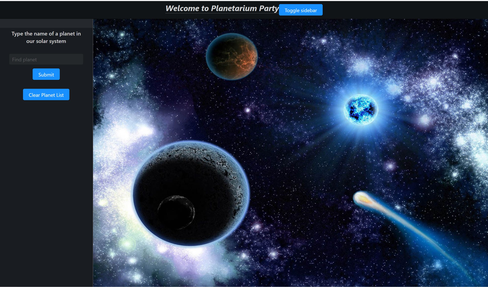

# Planetarium-Party

## About The Project

>[Link to the website- Join the Party!](https://emistew14.github.io/Planetarium-Party/)

>Created by Emily Stewart, Krista McPherson, & Maribel Ellison

>This project is an app that allows users to search for their favorite planet and in return they'll get an image from the NASA API and a portion of the Wikipedia article about that planet. It features continuous dark mode to enhance the feel of being in space.

### Built With

* [HTML]
* [CSS]
* [Javascript]
* [JQuery]
* [Halfmoon-CSS]
* [Nasa-API]
* [Wikipedia-API]

## Contact

Emily Stewart - [Github pages](https://emistew14.github.io/)
Krista McPherson - [Github pages](https://kmcpherson49.github.io/)
Maribel Ellison - [Github pages](https://Mellison8186.github.io/)

Project Link: [https://github.com/EmiStew14/Planetarium-Party](https://github.com/EmiStew14/Planetarium-Party)
